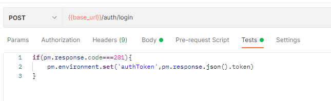
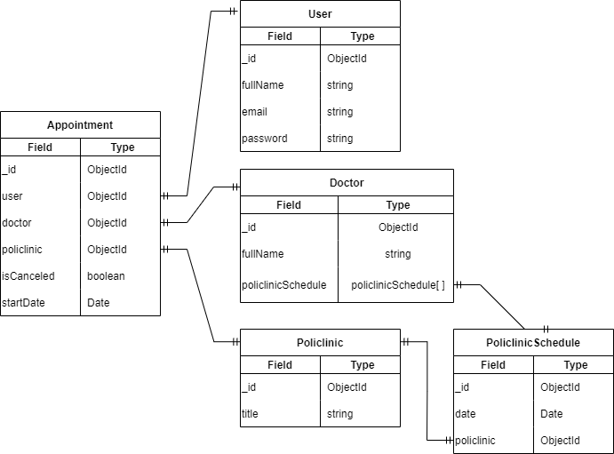
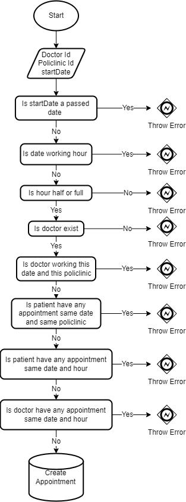

<p align="center">
  <a href="http://nestjs.com/" target="blank"></a>
</p>

# <center>A Hospital Management System</center>

## Tech Stack

- NestJS
  - Deployed on [<ins>railway</ins>](https://hospital-management.up.railway.app/).
- MongoDB
  - Deployed on Atlas.
- Jest
- Docker

## Postman Files

You can fork postman [<ins>collection</ins>](https://www.postman.com/interstellar-satellite-731506/workspace/melih-kzmaz-public-workspace/collection/18029963-911fd454-a6ed-42fe-a17b-ff924c308ca4?action=share&creator=18029963) and [<ins>environment</ins>](https://www.postman.com/interstellar-satellite-731506/workspace/melih-kzmaz-public-workspace/environment/18029963-1e1ad911-8b4f-4264-a64c-22a587b285c7).

You can take a look at the postman documentation [<ins>here</ins>](https://documenter.getpostman.com/view/18029963/UzJJud3d).

When you import the postman collection and the environment, the **_Tests script_** is saves the bearer token to the environment if loggin was succesfull.
You can see **_Tests script_** image below.

<p align="center">
 
</p>

## Mail Service

I chose the gmail service for the mail service, if you want to try it in local, you need to get the password for the applications from the link [<ins>here</ins>](https://support.google.com/accounts/answer/185833?visit_id=637926101930690949-3658004164&p=InvalidSecondFactor&rd=1).
If you are going to do your tests on the deploy application, please enter a real mail while registering.

## Installation

```bash
# Install dependencies
$ yarn
```

## Running the app

```bash
# Build and start the container
$ docker-compose up -d

# Watch mode
$ yarn start:dev
```

## Testing

```bash
# Start all unit tests
$ yarn test
```

## <center>Database relation diagram</center>

<p align="center">
 
</p>

## <center>Create Appointment Flow</center>

<p align="center">
 
</p>
